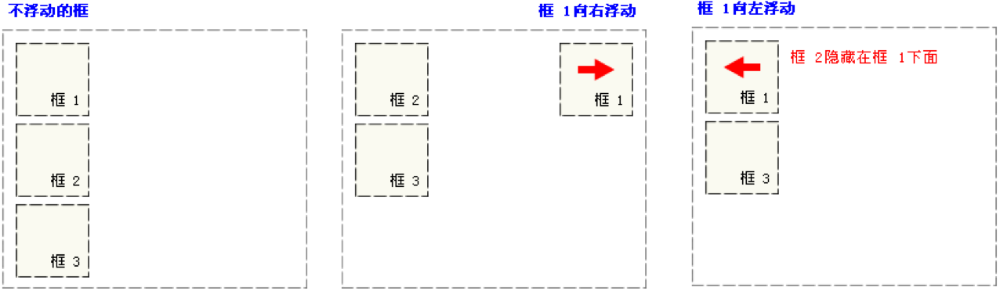
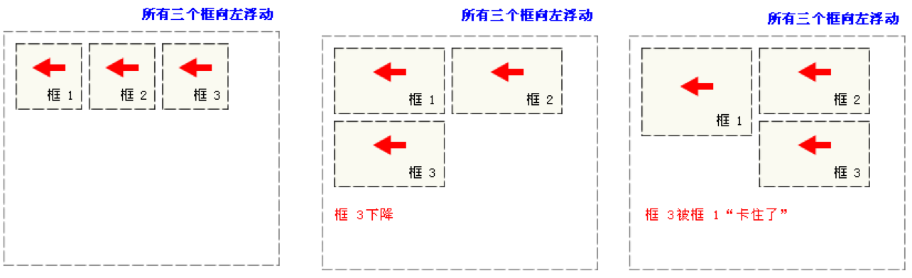

## 本章目标

 会使用HTML的基本结构创建网页

会使用文本相关标签排版文本信息

会使用a标签创建超链接、锚链接以及功能性链接


## Hello HTML Element

HTML : Hyper Text Markup Language (超文本标记语言)

Most HTML elements have an opening tag and a closing tag（大部分HTML元素都有一个开始标记和一个结束标记）.

```html
<HTML> <-- this opening tag
  
</HTML> <-- this closing tag
```


## 布局 

#### 流动模型

是默认的网页布局模式，也就是说网页在默认状态下的HTML网页元素都是根据流动模型来分布网页内容的。

特征: 块状元素都会在所处的包含元素内自上而下按顺序垂直延伸分布，因为在默认状态下，块状元素的宽度都为100%。实际上，块状元素都会以行的形式占据位置。在流动模型下，内联元素都会在所处的包含元素内从左到右水平分布显示。（内联元素可不像块状元素这么霸道独占一行）。


#### 浮动模型



浮动的元素可以在左右移动，直到它的外边框边缘碰到包含块或另一个浮动元素的边缘。



如果包含块太窄，无法容纳水平排列的浮动元素，那么其他浮动元素向下移动，直到有足够多的空间。如果浮动元素的高度不同，那么当它们向下移动时可能会被其他浮动元素卡住。


#### 层布局

层布局模型就像是图像软件PhotoShop中非常流行的图层编辑功能一样，每个图层能够精确定位操作

1. 绝对定位(position: absolute)
2. 相对定位(position:relative)
3. 固定定位(position:fixed)
   - z-index控制堆叠次序 z-index的值越高， 框的位置就上面。

## Git 代码版本控制

为了在接下来更好的追踪项目代码的更改，我们还需要将新建的  项目纳入到 Git 版本管理中：

```
$ cd 
$ git init
```

提交代码:

```
$ git add -A
$ git commit -m "initial"
```

推送代码:

```
$ git pull
```


## 推荐

[GitHub](https://github.com/)

[freecodecamp 中文](https://www.freecodecamp.cn/)

[freecodecamp english](https://www.freecodecamp.org/)